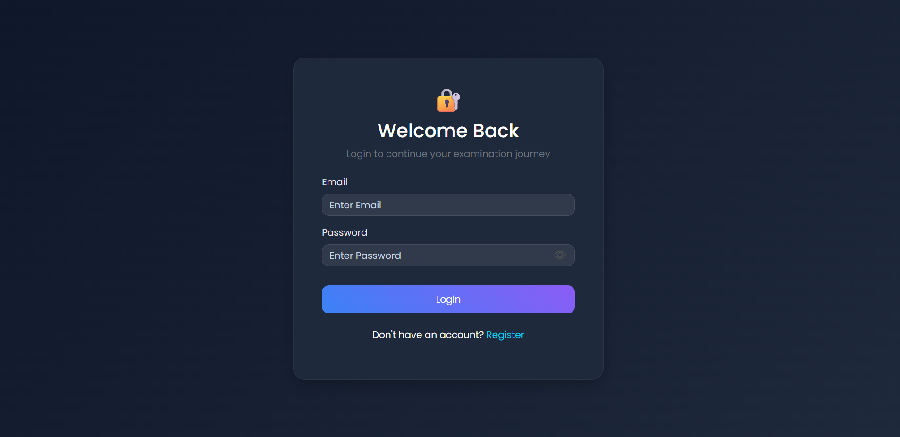
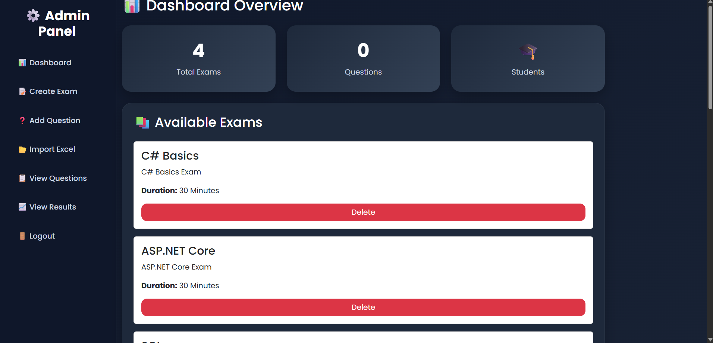
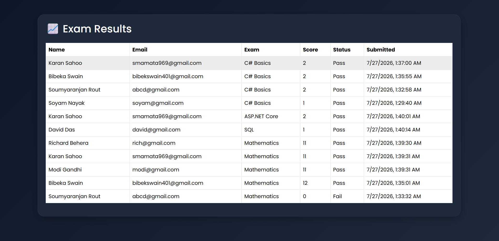

# Smart Online Examination System

## Live Demo

https://smartexamsystem-v1-1.onrender.com

## Overview

Smart Online Examination System is a full-stack web application that enables administrators to create and manage examinations while allowing students to attend online exams and view results securely.

## Features

### Admin

* Create and manage exams
* Add, edit, and delete questions
* Import questions from Excel
* View student results
* Dashboard analytics

### Student

* Registration and Login
* Attend online exams
* Real-time exam timer
* Instant result generation
* Email result notification

## Security

* JWT Authentication
* Role-Based Authorization
* BCrypt Password Hashing

## Tech Stack

### Backend

* ASP.NET Core Web API
* Entity Framework Core
* PostgreSQL

### Frontend

* HTML
* CSS
* Bootstrap
* JavaScript

### Deployment

* Render

## Database Tables

* Users
* Exams
* Questions
* Results

## Future Enhancements

* Certificate Generation
* PDF Reports
* Advanced Analytics
* Anti-Cheating Features

## Screenshots

### Login Page

### Admin Dashboard

### Exam Page

### Results Page

## Author

Soumya Ranjan Nayak
